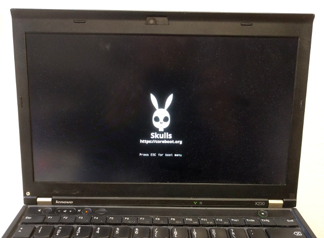

# Skulls - not quite Heads
pre-built [coreboot](https://www.coreboot.org/) image and documentation on
how to flash them.

Skulls makes it easy to bring an _unlocked_, _up-to-date_ and _easy to use_
coreboot-based BIOS to your laptop.

* _unlocked_: software update after first-time flashing / no restrictions on conncected hardware
* _easy to use_: SeaBIOS - simply a boot menu, compatible with Windows and Linux
* _up to date_: Frequently a new image with the latest versions of all components

## Supported Laptops

* [Thinkpad X230](x230/README.md).

## When do we do a release?
Either when
* There is a new SeaBIOS release,
* There is a new Intel microcode release (for our CPU model),
* There is a coreboot issue that affects us, or
* We change the config

## How we build
* Everything necessary to [build coreboot](https://www.coreboot.org/Build_HOWTO) is included here
* When doing a release, we always try to upload to coreboot's [board status project](https://www.coreboot.org/Supported_Motherboards)
* If we add out-of-tree patches, we always [post them for review](http://review.coreboot.org/) upstream

## Alternatives
We aim to be the easiest possible coreboot distribution - both
to install and to use. And since our image is unlocked to enable easy
software updates, it's easy to move to alternative systems from it:

* [Heads](https://github.com/osresearch/heads/releases) - coreboot distribution
with pre-built (or reproducibly buildable) flash images (for the X230 and others). Heads
includes Linux, with tools to create a trusted boot chain using your GPG key
and the TPM.
* [libreboot](https://libreboot.org/) - also a coreboot distribution with pre-built
image releases. The X230 is currently not supported (the X200 is) - libreboot
images are built from free software only and include the GRUB bootloader.
