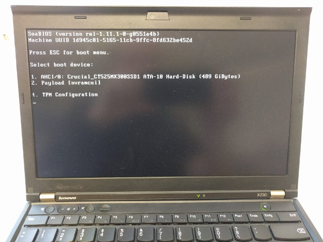
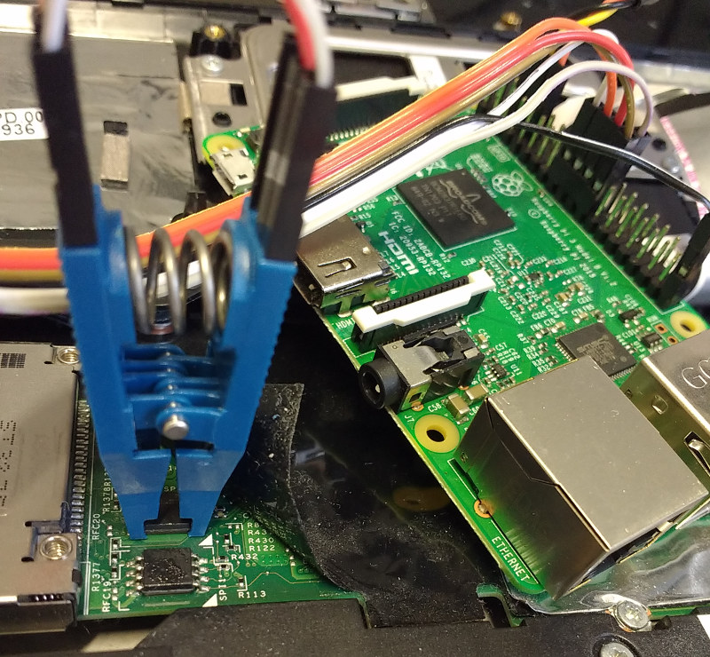

# coreboot-x230
pre-built [coreboot](https://www.coreboot.org/) image and documentation on
how to flash them for the
[Thinkpad X230](https://pcsupport.lenovo.com/en/products/laptops-and-netbooks/thinkpad-x-series-laptops/thinkpad-x230).
SeaBIOS is used, to be compatible with Windows and Linux, and to be easy to use:
simply a boot menu and a few options to tick.

We want to make it easy to "bootstrap" an X230 to a working, unlocked,
up-to-date coreboot-based BIOS.

## Latest release (config overview and version info)
* coreboot-x230 0.0.5 - see our [release page](https://github.com/merge/coreboot-x230/releases)
* The only proprietary binary, the VGA BIOS is executed in "secure" mode ([PCI_OPTION_ROM_RUN_YABEL](https://www.coreboot.org/Coreboot_Options))

### coreboot
* We simply take coreboot's current state in it's master branch at the time we build a release image.
That's the preferred way to use coreboot. The git revision we use is always included in the release.

### Intel microcode
* revision `1f` from 2018-02-07 (Intel package [20180312](https://downloadcenter.intel.com/download/27591) not yet in coreboot upstream) under [Intel's license](LICENSE.microcode)

### SeaBIOS
* version [1.11.1](https://seabios.org/Releases) from 2018-03-19 (part of coreboot upstream)

## table of contents
* [TL;DR](#tl-dr)
* [Flashing for the first time](#flashing-for-the-first-time)
* [How to update](#how-to-update)
* [When do we do a release?](#when-do-we-do-a-release)
* [How we build](#how-we-build)
* [Why does this work](#why-does-this-work)
* [Alternatives](#alternatives)

## TL;DR
For first-time flashing, remove the keyboard and palmrest, and (using a
Raspberry Pi), run `flashrom_rpi_bottom_unlock.sh` on the lower chip
and `flashrom_rpi_top_write.sh` on the top chip of the two.

For updating later, run `prepare_internal_flashing.sh` to get
files and instructions about updating. No need to disassemble.

## Flashing for the first time
Especially for the first time, you must flash externally. See below for the details
for using a Rapberry Pi, for example.

### flashrom chip config
We (or our scripts) use [flashrom](https://flashrom.org/) for flashing. Run
`flashrom -p <your_hardware>` (for [example](#how-to-flash)
`flashrom -p linux_spi:dev=/dev/spidev0.0,spispeed=128` for the
Raspberry Pi) to let flashrom detect the chip.
It will probably list a few you need to choose from when flashing
(by adding `-c <chipname>`). Please review the chip model for your device.
In case you are unsure what to specify, here's some examples we find out there:

#### 4MB chip
* `MX25L3206E` seems to mostly be in use

#### 8MB chip
* `MX25L6406E/MX25L6408E` is used in [this guide](https://github.com/mfc/flashing-docs/blob/master/walkthrough%20for%20flashing%20heads%20on%20an%20x230.md#neutering-me)
* `MX25L3206E/MX25L3208E` is seen working with various X230 models.
* `EN25QH64` is used sometimes

### EC firmware (optional)
Enter Lenovo's BIOS with __F1__ and check the embedded controller (EC) version to be
__1.14__ and upgrade using
[the latest bootable CD](https://support.lenovo.com/at/en/downloads/ds029188)
if it isn't. This updates BIOS and EC. The EC cannot be upgraded when coreboot
is installed. (In case a newer version should ever be available (I doubt it),
you could temporarily flash back the original Lenovo BIOS image from your
backup)

### ifd unlock and me_cleaner: the 8MB chip
The Intel Management Engine resides on the 8MB chip (at the bottom, closer to
you). We don't need to touch it
for coreboot-upgrades in the future, but to enable internal flashing, we need
to unlock it once.
We run [ifdtool](https://github.com/coreboot/coreboot/tree/master/util/ifdtool)
and, while we are at it, [me_cleaner](https://github.com/corna/me_cleaner) on it:

We support using a RPi, see below for the connection details.
Move the release-tarball to the RPi (USB Stick or however) and unpack it
(to the current directory and change into it):

	mkdir tarball_extracted
	tar -xf <tarball>.tar.xz -C tarball_extracted
	cd tarball_extracted

And finally unlock the 8M chip by using the included script (be patient):

	sudo ./flashrom_rpi_bottom_unlock.sh -m -c <chipname> -k <backup.bin>

That's it. Keep the backup safe.

when updating to a new release, you don't have to disasseble your Thinkpad
and can flash internally (at your own risk), see below.

#### background (just so you know)
* The `-m` option above also runs `me_cleaner -S` before flashing back.
* The `-l` option will (re-)lock your flash ROM, in case you want to force
yourself (and others) to hardware-flashing externally.
* If you don't use a RPi, change the flashrom programmer to your needs.This
is roughly what's going on:

      flashrom -p linux_spi:dev=/dev/spidev0.0,spispeed=128 -c "MX25L6406E/MX25L6408E" -r ifdmegbe.rom
      flashrom -p linux_spi:dev=/dev/spidev0.0,spispeed=128 -c "MX25L6406E/MX25L6408E" -r ifdmegbe2.rom
      diff ifdmegbe.rom ifdmegbe2.rom
      git clone https://github.com/corna/me_cleaner.git && cd me_cleaner
      ./me_cleaner.py -S -O ifdmegbe_meclean.rom ifdmegbe.rom
      ifdtool -u ifdmegbe_meclean.rom
      flashrom -p linux_spi:dev=/dev/spidev0.0,spispeed=128 -c "MX25L6406E/MX25L6408E" -w ifdmegbe_meclean.rom.new

### BIOS: the 4MB chip
(internally, memory of the two chips is mapped together, the 8MB being the lower
part, but we can essientially ignore that). Again, using a RPi is supported
here. We assume you have the unpacked release tarball ready, see above. Use
the following included script:

	sudo ./flashrom_rpi_top_write.sh -i x230_coreboot_seabios_<hash>_top.rom -c <chipname> -k <backup>

That's it. Keep the backup safe.

## How to update
When __upgrading__ to a new release, only the "upper" 4MB chip has to be written.
Download the latest release image we provide and flash it:

### Example: internal
CAUTION: THIS IS NOT ENCOURAGED

* Only for _updating_! You have to have your 8MB chip flashed externally using
our `flashrom_rpi_bottom_unlock.sh` script (`ifdtool -u`) before this, once
* very convenient: just install flashrom, but according to the [flashrom manpage](https://manpages.debian.org/stretch/flashrom/flashrom.8.en.html) this is very dangerous!
* Boot Linux with the `iomem=relaxed` boot parameter (for example set in /etc/default/grub)
* download the latest release tarball (4MB "top" BIOS image is included) and extract it
* run `prepare_internal_flashing.sh` for generating all necessary files and printing all instructions
* run the flashrom command you got from the script. That's it.

### Example: Raspberry Pi 3

Here you'll flash externally, using a "Pomona 5250 8-pin SOIC test clip". You'll find
one easily. This is how the X230's SPI connection looks on both chips:

		Screen (furthest from you)
			     __
		  MOSI  5 --|  |-- 4  GND
		   CLK  6 --|  |-- 3  N/C
		   N/C  7 --|  |-- 2  MISO
		   VCC  8 --|__|-- 1  CS

		   Edge (closest to you)

and with our release tarball unpacked, the command you need looks like so:

	flashrom_rpi_top_write.sh -i x230_coreboot_seabios_<release>_top.rom -c <chipname>

We run [Raspbian](https://www.raspberrypi.org/downloads/raspbian/)
and have the following setup
* [Serial connection](https://elinux.org/RPi_Serial_Connection) using a "USB to Serial" UART Adapter and picocom or minicom
* Yes, in this case you need a second PC connected to the RPi over UART
* in the SD Cards's `/boot/config.txt` file `enable_uart=1` and `dtparam=spi=on`
* [For flashrom](https://www.flashrom.org/RaspberryPi) we put `spi_bcm2835` and `spidev` in /etc/modules
* [Connect to a wifi](https://www.raspberrypi.org/documentation/configuration/wireless/wireless-cli.md) or to network over ethernet to `sudo apt-get flashrom`
* only flash the top 4M chip
* connect the Clip to the Raspberry Pi 3 (there are [prettier images](https://github.com/splitbrain/rpibplusleaf) too:

		   Edge of pi (furthest from you)
		               (UART)
		 L           GND TX  RX                           CS
		 E            |   |   |                           |
		 F +---------------------------------------------------------------------------------+
		 T |  x   x   x   x   x   x   x   x   x   x   x   x   x   x   x   x   x   x   x   x  |
		   |  x   x   x   x   x   x   x   x   x   x   x   x   x   x   x   x   x   x   x   x  |
		 E +----------------------------------^---^---^---^-------------------------------^--+
		 D                                    |   |   |   |                               |
		 G                                   3.3V MOSIMISO|                              GND
		 E                                 (VCC)         CLK
		   Body of Pi (closest to you)

Now copy our release tarball over to the Rasperry Pi.
One way to copy, is convertig it to ascii using
`uuencode` (part of Debian's sharutils package) described below. This is a
direct, shady and slow way to transfer a file. Use a USB
Stick or scp instead. :) (but you need even more hardware or a network).

		(convert)
	host$ uuencode <tarball> <tarball>.ascii > <tarball>.ascii
		(transfer)
	rpi$ cat > <tarball>.ascii
	host$ pv <tarball>.ascii > /dev/ttyUSBX
		(wait)
	rpi$ (CTRL-D)
		(convert back)
	rpi$ uudecode -o <tarball> <tarball>.ascii
		(verify)
	host$ sha1sum <tarball>
	rpi$ sha1sum <tarball>

Now unpack it:

	mkdir tarball_extracted
	tar -xf <tarball> -C tarball_extracted
	cd tarball_extracted

Check the SPI connection to the "top" chip to update, and run:

	sudo ./flashrom_rpi_top_write.sh -i x230_coreboot_seabios_<hash>_top.rom -c <chipname>

That's it.

#### background (just so you know)
* Connecting an ethernet cable as a power-source for SPI (instead of the VCC pin)
  is not necessary (some other flashing how-to guides mention this).
  Setting a fixed (and low) SPI speed for flashrom offeres the same stability.
  Our scripts do this for you.

## When do we do a release?
Either when
* There is a new SeaBIOS release,
* There is a new Intel microcode release (for our CPU model),
* There is a coreboot issue that affects us, or
* We change the config

## How we build
* Everything necessary to build coreboot (while only the top 4MB are usable of course) is included here
* The task of [building coreboot](https://www.coreboot.org/Build_HOWTO) is not too difficult
* When doing a release here, we always try to upload to coreboot's [board status project](https://www.coreboot.org/Supported_Motherboards)
* If we add out-of-tree patches, we always [post them for review](http://review.coreboot.org/) upstream

## Why does this work?
On the X230, there are 2 physical "BIOS" chips. The "upper" 4MB
one holds the actual bios we can generate using coreboot, and the "lower" 8MB
one holds the rest that you can [modify yourself once](#flashing-for-the-first-time),
if you like, but strictly speaking, you
[don't need to touch it at all](https://www.coreboot.org/Board:lenovo/x230#Building_Firmware).
What's this "rest"?
Mainly a tiny binary used by the Ethernet card and the Intel Management Engine.

## Alternatives
We aim to be the easiest possible coreboot distribution for the X230 - both
to install and to use. And since our images are unlocked to enable easy
software updates, it's easy to try alternative systems too:

* [Heads](https://github.com/osresearch/heads/releases) - coreboot distribution
with pre-built (or reproducibly buildable) flash images for the X230. Heads
includes Linux, with tools to create a trusted boot chain using your GPG key
and the TPM.
* [libreboot](https://libreboot.org/) - also a coreboot distribution with pre-built
image releases. But the X230 is currently not supported (the X200 is) - libreboot
images are built from free software only and include the GRUB bootloader.
