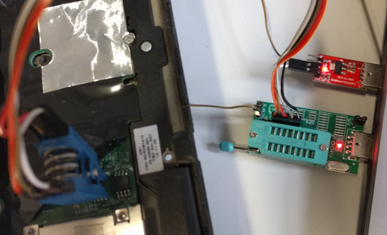

# Skulls - [Thinkpad T430](https://pcsupport.lenovo.com/uu/de/products/laptops-and-netbooks/thinkpad-t-series-laptops/thinkpad-t430)

## Latest release
Get it from our [release page](https://github.com/merge/skulls/releases)
* __coreboot__: We take coreboot's master branch at the time we build a release image.
* __microcode update__: revision `0x21` from 2019-02-13
* __SeaBIOS__: version [1.16.0](https://seabios.org/Releases) from 2022-03-01

## table of contents
* [TL;DR](#tldr)
* [First-time installation](#first-time-installation)
* [Updating](#updating)
* [Why does this work](#why-does-this-work)
* [How to rebuild](#how-to-reproduce-the-release-images)

## TL;DR
1. run `sudo ./skulls.sh -b t430` on your current T430 Linux system
2. Power down, remove the battery. Remove the keyboard and palmrest. Connect
a hardware flasher to an external PC (or a Raspberry Pi with a SPI 8-pin chip clip
can directly be used), and run
`sudo ./external_install_bottom.sh` on the lower chip
and `sudo ./external_install_top.sh -b t430` on the top chip of the two.
3. For updating later, run `./skulls.sh -b t430`. No need to disassemble.

And always use the latest [released](https://github.com/merge/skulls/releases)
package. This will be tested. The git master
branch is _not_ meant to be stable. Use it for testing only.

## First-time installation
#### before you begin
Run Linux on your T430, install `dmidecode` and run
`sudo ./skulls.sh -b t430`. It simply prints system information and
helps you to be up to date.

Make sure you have the latest skulls package release by running
`./skulls.sh -b t430 -U`.

#### preparation: required hardware
* An 8 Pin SOIC Clip, for example from
[Pomona electronics](https://www.pomonaelectronics.com/products/test-clips/soic-clip-8-pin)
(you'll find it
[somewhere](https://geizhals.eu/?fs=pomona+test+clip+5250) online)
* 6 [female](https://electronics.stackexchange.com/questions/37783/how-can-i-create-a-female-jumper-wire-connector)
[jumper wires](https://en.wikipedia.org/wiki/Jump_wire) like
[these](https://geizhals.eu/jumper-cable-female-female-20cm-a1471094.html)
to connect the clip to a hardware flasher (if not included with the clip)
* a hardware flasher
[supported by flashrom](https://www.flashrom.org/Flashrom/0.9.9/Supported_Hardware#USB_Devices), see below for the examples we support

#### open up the T430
Follow any disassembly tutorial you can find online. You need to almost
fully disassemble:

		Screen (furthest from you)

		   Edge (closest to you)

... choose __one of the following__ supported flashing hardware examples:

#### Hardware Example: Raspberry Pi 3
A Raspberry Pi can directly be a flasher through it's I/O pins, see below.
Use a test clip or hooks, see [required hardware](#preparation-required-hardware).

On the RPi we run [Raspbian](https://www.raspberrypi.org/downloads/raspbian/)
and have the following setup:
* Connect to the console: Either
  * connect a screen and a keyboard, or
  * Use the [Serial connection](https://elinux.org/RPi_Serial_Connection) using a
USB-to-serial cable (like [Adafruit 954](http://www.adafruit.com/products/954),
[FTDI TTL-232R-RPI](http://www.ftdichip.com/Products/Cables/RPi.htm) or
[others](https://geizhals.eu/usb-to-ttl-serial-adapter-cable-a1461312.html)) and
picocom (`picocom -b 115200 /dev/ttyUSB0`) or minicom
* in the SD Cards's `/boot/config.txt` file `enable_uart=1` and `dtparam=spi=on`
* [For flashrom](https://www.flashrom.org/RaspberryPi) we put `spi_bcm2835`
and `spidev` in /etc/modules
* [Connect to a wifi](https://www.raspberrypi.org/documentation/configuration/wireless/wireless-cli.md)
or ethernet to `sudo apt-get install flashrom`
* connect the Clip to the Raspberry Pi 3 (there are
[prettier images](https://github.com/splitbrain/rpibplusleaf) too):

		   Edge of pi (furthest from you)
		               (UART)
		 L           GND TX  RX                           CS
		 E            |   |   |                           |
		 F +---------------------------------------------------------------------------------+
		 T |  x   x   x   x   x   x   x   x   x   x   x   x   x   x   x   x   x   x   x   x  |
		   |  x   x   x   x   x   x   x   x   x   x   x   x   x   x   x   x   x   x   x   x  |
		 E +----------------------------------^---^---^---^-------------------------------^--+
		 D                                    |   |   |   |                               |
		 G                                   3.3V MOSIMISO|                              GND
		 E                                 (VCC)         CLK
		   Body of Pi (closest to you)

##### Plug your RPI into an 8 Pin SOIC Clip

| Pin Number | Clip (25xx signal) | Raspberry Pi |
| --------------- | --------------- | --------------- |
| 1 | CS | 24 |
| 2 | MISO | 21 |
| 3 | *not used* | *not used* |
| 4 | GND | 25 |
| 5 | MOSI | 19 |
| 6 | CLK | 23 |
| 7 | *not used* | *not used* |
| 8 | 3.3V |  |

Connect corresponding RPI Pins, according to the images above.

Now copy the Skulls release tarball over to the Rasperry Pi and
[continue](#unpack-the-skulls-release-archive) on the Pi.

#### Hardware Example: CH341A based
The CH341A from [Winchiphead](http://www.wch.cn/), a USB interface chip,
is used by some cheap memory programmers.
The one we describe can be bought at
aliexpress
but it's available [elsewhere](https://geizhals.eu/?fs=ch341a) too.
This means you need a different computer running a Linux based system here.
Also, we don't use the included 3,3V power output (provides too little power),
but a separate power supply. If you don't have any, consider getting a AMS1117
based supply for a second USB port (like [this](https://de.aliexpress.com/item/1PCS-AMS1117-3-3V-Mini-USB-5V-3-3V-DC-Perfect-Power-Supply-Module/32785334595.html) or [this](https://www.ebay.com/sch/i.html?_nkw=ams1117+usb)).

* Leave the P/S Jumper connected (programmer mode, 1a86:5512 USB device)
* Connect 3,3V from your external supply to the Pomona clip's (or hook) VCC
* Connect GND from your external supply to GND on your CH341A programmer
* Connect your clip or hooks to the rest of the programmer's SPI pins
* Connect the programmer (and power supply, if USB) to your PC's USB port

#### unpack the Skulls release archive

	tar -xf skulls-<version>.tar.xz
	cd skulls-<version>

#### ifd unlock and me_cleaner: the 8MB chip

With the chips at the edge of the board closer to you, this is the left
chip. Flashing the left chip is optional but highly recommended.
It has the same pinout as the other chip. When you don't unlock it
with an external flasher, you can't flash internally and fix the
[security issues](https://en.wikipedia.org/wiki/Intel_Management_Engine#Security_vulnerabilities)
in the
[Intel Management Engine](https://en.wikipedia.org/wiki/Intel_Management_Engine).

	sudo ./external_install_bottom.sh -m -k <backup-file-to-create>

That's it. Keep the backup safe. Here are the options (just so you know):

* The `-m` option applies `me_cleaner -S -d` before flashing back, see
[me_cleaner](https://github.com/corna/me_cleaner).
* The `-l` option will (re-)lock your flash ROM, in case you want to force
yourself (and others) to hardware-flashing, see [updating](#updating).

#### Your BIOS: the 4MB chip
This is the right chip of the 2. Choose the image to flash during running:

	sudo ./external_install_top.sh -b t430 -k <backup-file-to-create>

This selects and flashes it and that's it.
Keep the backup safe, assemble and
turn on the T430. coreboot will do hardware init and start SeaBIOS.

## Updating
If you have locked your flash (i.e. `./external_install_bottom -l`) you can
flash externally using `external_install_top.sh -b t430` just like the
first time, see above. Only the "upper" 4MB chip has to be written.

It is recommended to do the update directly on your T430 using Linux
though. This is considered more safe for your hardware and is very convenient -
just install the "flashrom" program and run  `./skulls.sh -b t430`, see below.

1. boot Linux with the `iomem=relaxed` boot parameter (for example in /etc/default/grub `GRUB_CMDLINE_LINUX_DEFAULT`)
2. [download](https://github.com/merge/skulls/releases) the latest Skulls release tarball and unpack it or check for updates by running `./skulls.sh -b t430 -U`.
3. run `sudo ./skulls.sh -b t430` and choose the image to flash.

Hint: In case your Linux distribution's GRUB bootloader doesn't use the full
screen, put the line `GRUB_GFXMODE=1366x768x32` in your `/etc/default/grub` file
(and run `update_grub`).

## Why does this work?
On the T430, there are 2 physical "BIOS" chips. The 4MB
one holds the actual bios we can generate using coreboot, and the 8MB
one holds the rest that you can [modify yourself once](#first-time-installation),
if you like, but strictly speaking, you
[don't need to touch it at all](https://www.coreboot.org/Board:lenovo/x230#Building_Firmware).
What's this "rest"?
Mainly a tiny binary used by the Ethernet card and the Intel Management Engine.
Read the [coreboot documentation](https://doc.coreboot.org/mainboard/lenovo/t430.html)
for more details.

## how to reproduce the release images
* `git clone https://github.com/merge/skulls`
* `cd skulls/t430`
* `git checkout 1.0.0` for the release you want to build.
* `./build.sh` and choose the configuration you want to build.

### replace the splashscreen image
In order to create your own splashscreen image, before building,
overwrite the `bootsplash.jpg` with your own JPEG, using
* "Progressive" turned off, and
* "4:2:0 (chroma quartered)" Subsampling

