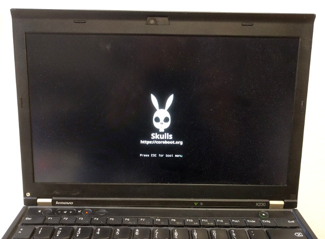

# Skulls - [Thinkpad X230](https://pcsupport.lenovo.com/en/products/laptops-and-netbooks/thinkpad-x-series-laptops/thinkpad-x230) with FHD mod

## Supported Hardware Modifications
The motherboard may be modified to use the 2nd Display Port from the dock
as the integrated panel's connection, which allows using a Full HD (FHD)
eDP panel instead of the stock LVDS display.

To make this work with coreboot a [patch](https://review.coreboot.org/c/coreboot/+/28950)
is automatically applied. It disables the internal LVDS connector and also allows
brightness controls to work out of the box.

*Note: this is currently only tested with the [Nitrocaster FHD mod](https://forum.thinkpads.com/viewtopic.php?f=43&t=122640).*

## Latest release
Get it from our [release page](https://github.com/merge/skulls/releases)
* __coreboot__: We take coreboot's master branch at the time we build a release image.
* __microcode update__: revision `0x21` from 2019-02-13
* __SeaBIOS__: version [1.13.0](https://seabios.org/Releases) from 2019-12-09

### release images to choose from
We release multiple different, but _very similar_ images you can choose from.
They all should work on all versions of the X230 FHD. These are the
differences; (xxxxxxxxxx stands for random characters in the filename):
* `x230_fhd_coreboot_seabios_xxxxxxxxxx_top.rom` includes the _proprietary_
[VGA BIOS](https://en.wikipedia.org/wiki/Video_BIOS) from [Intel](https://www.intel.com/content/www/us/en/intelligent-systems/intel-embedded-graphics-drivers/faq-bios-firmware.html)
which is non-free software. It is executed in "secure" mode.
* `x230_fhd_coreboot_seabios_free_xxxxxxxxxx_top.rom` includes the
[VGA BIOS](https://en.wikipedia.org/wiki/Video_BIOS)
[SeaVGABIOS](https://www.seabios.org/SeaVGABIOS) which is free software.
While technically more interesting, visually this is currently not as
beautiful:
  * The [bootspash image is not shown](https://github.com/merge/skulls/issues/59).
  * Early boot console messages (after your HDD's bootloader has started a kernel) might be [missing](https://github.com/merge/skulls/issues/46).

## table of contents
* [TL;DR](#tldr)
* [First-time installation](#first-time-installation)
* [Updating](#updating)
* [Moving to Heads](#moving-to-heads)
* [Why does this work](#why-does-this-work)
* [How to rebuild](#how-to-reproduce-the-release-images)
* [How to replace the splashscreen image](#how-to-replace-the-splashscreen-image)

## TL;DR
1. run `sudo ./x230_fhd_skulls.sh` on your current X230 Linux system
2. Power down, remove the battery. Remove the keyboard and palmrest. Connect
a hardware flasher to an external PC (or a Raspberry Pi with a SPI 8-pin chip clip
can directly be used), and run
`sudo ./external_install_bottom.sh` on the lower chip
and `sudo ./external_install_top.sh` on the top chip of the two.
3. For updating later, run `./x230_fhd_skulls.sh`. No need to disassemble.

And always use the latest [released](https://github.com/merge/skulls/releases)
package. This will be tested. The git master
branch is _not_ meant to be stable. Use it for testing only.

## First-time installation
Same steps as the X230 without FHD mod (see [First-time installation](https://github.com/jyvet/skulls/blob/master/x230/README.md#first-time-installation)).

## Updating
If you have locked your flash (i.e. `./external_install_bottom -l`) you can
flash externally using `external_install_top.sh` just like the
first time, see above. Only the "upper" 4MB chip has to be written.

It is recommended to do the the update directly on your X230 using Linux
though. This is considered more safe for your hardware and is very convenient -
just install the "flashrom" program and run  `./x230_fhd_skulls.sh`, see below.

1. boot Linux with the `iomem=relaxed` boot parameter (for example in /etc/default/grub `GRUB_CMDLINE_LINUX_DEFAULT`)
2. [download](https://github.com/merge/skulls/releases) the latest Skulls release tarball and unpack it or check for updates by running `./x230_fhd_skulls.sh -U`.
3. run `sudo ./x230_fhd_skulls.sh` and choose the image to flash.

Hint: In case your Linux distribution's GRUB bootloader doesn't use the full
screen, put the line `GRUB_GFXMODE=1366x768x32` in your `/etc/default/grub` file
(and run `update_grub`).

## Moving to Heads
*Not supported yet.*

## Why does this work?
On the X230, there are 2 physical "BIOS" chips. The "upper" 4MB
one holds the actual bios we can generate using coreboot, and the "lower" 8MB
one holds the rest that you can [modify yourself once](#first-time-installation),
if you like, but strictly speaking, you
[don't need to touch it at all](https://www.coreboot.org/Board:lenovo/x230#Building_Firmware).
What's this "rest"?
Mainly a tiny binary used by the Ethernet card and the Intel Management Engine.
Read the [coreboot documentation](https://doc.coreboot.org/mainboard/lenovo/xx30_series.html)
for more details.

## How to reproduce the release images
* `git clone https://github.com/merge/skulls`
* `cd skulls/x230_fhd`
* `git checkout 0.1.0` for the release you want to build. In this example 0.1.5.
* `./build.sh` and choose the configuration you want to build

## How to replace the splashscreen image
In order to create your own splashscreen image, before building,
overwrite the `splashscreen.jpg` with your own JPEG, using
* "Progressive" turned off, and
* "4:2:0 (chroma quartered)" Subsampling

